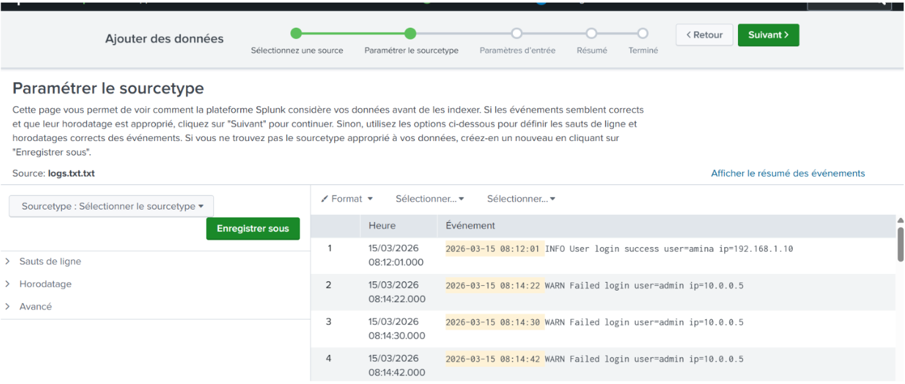
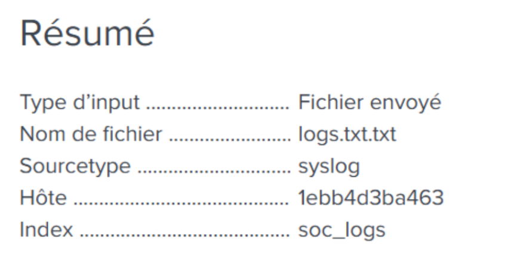
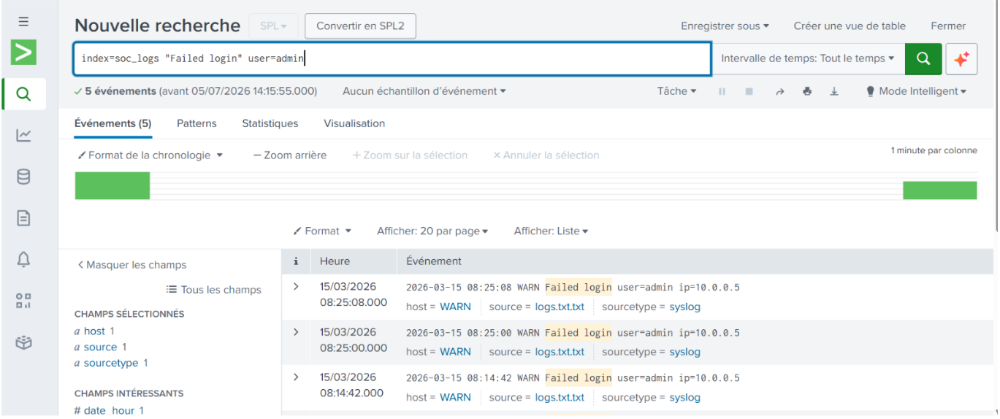
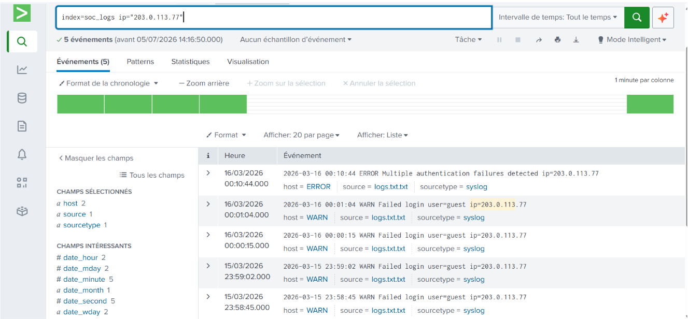
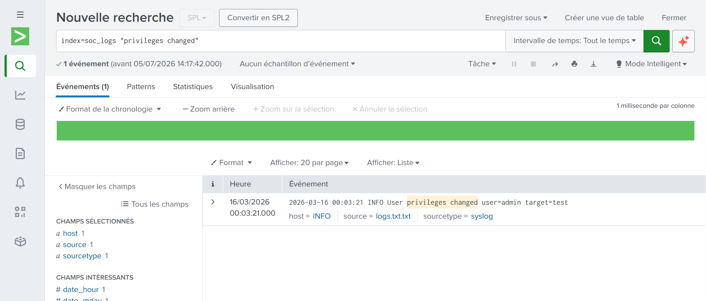
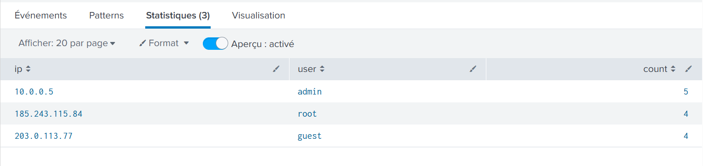
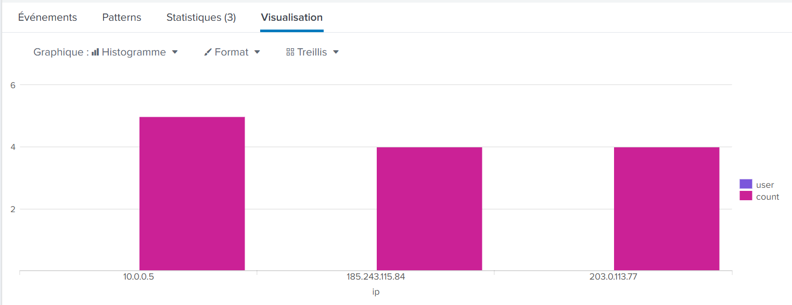
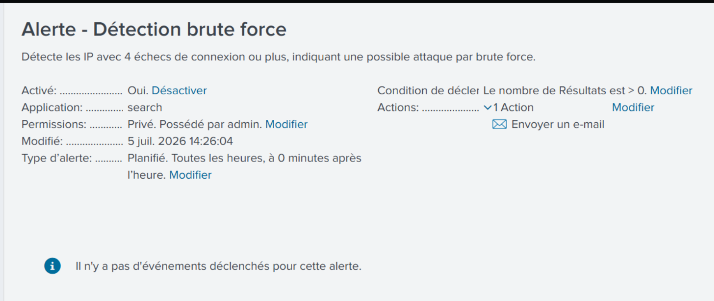
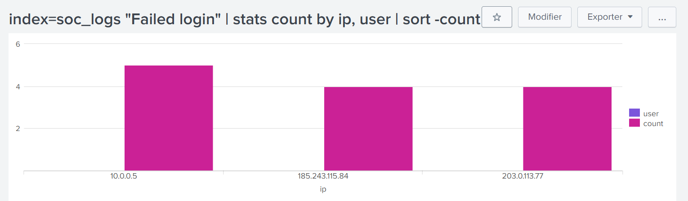

# Mini-SOC – Supervision et détection avec Splunk (SIEM)

Projet de cybersécurité consistant à mettre en place un environnement SIEM avec Splunk afin d'ingérer des logs d'authentification, corréler des événements de sécurité et détecter automatiquement des activités suspectes.

## Objectif

L'objectif de ce projet est de construire une chaîne de détection complète :

```
Logs bruts -> Ingestion Splunk -> Recherche / corrélation -> Alerte -> Dashboard
```

Ce travail permet de :

- ingérer des logs d'authentification dans un SIEM
- écrire des requêtes SPL pour retrouver des comportements suspects
- détecter automatiquement des IP à risque par corrélation, sans les connaître à l'avance
- déclencher une alerte sur un pattern de brute force
- visualiser les résultats dans un dashboard

## Environnement

- Splunk Enterprise (image officielle `splunk/splunk`), exécuté en local via Docker
- Logs d'authentification au format texte (connexions réussies, échecs, changements de privilèges)

```bash
docker run -d -p 8000:8000 -p 8088:8088 \
  -e SPLUNK_GENERAL_TERMS=--accept-sgt-current-at-splunk-com \
  -e SPLUNK_START_ARGS=--accept-license \
  -e SPLUNK_PASSWORD=Splunk2026! \
  --name splunk splunk/splunk:latest
```



## Source des données

Les logs analysés couvrent une période de deux jours et contiennent des événements d'authentification :

```
2026-03-15 08:12:01 INFO  User login success user=amina ip=192.168.1.10
2026-03-15 08:14:22 WARN  Failed login user=admin ip=10.0.0.5
2026-03-15 08:14:30 WARN  Failed login user=admin ip=10.0.0.5
2026-03-15 08:14:42 WARN  Failed login user=admin ip=10.0.0.5
2026-03-15 08:17:55 WARN  Failed login user=root ip=185.243.115.84
2026-03-15 08:18:03 WARN  Failed login user=root ip=185.243.115.84
2026-03-15 08:18:11 WARN  Failed login user=root ip=185.243.115.84
2026-03-15 08:18:19 WARN  Failed login user=root ip=185.243.115.84
2026-03-15 08:30:14 INFO  User login success user=admin ip=10.0.0.5
2026-03-15 23:58:45 WARN  Failed login user=guest ip=203.0.113.77
2026-03-15 23:59:02 WARN  Failed login user=guest ip=203.0.113.77
2026-03-16 00:00:15 WARN  Failed login user=guest ip=203.0.113.77
2026-03-16 00:01:04 WARN  Failed login user=guest ip=203.0.113.77
2026-03-16 00:03:21 INFO  User privileges changed user=admin target=test
2026-03-16 00:10:44 ERROR Multiple authentication failures detected ip=203.0.113.77
```

## Ingestion dans Splunk

Les logs ont été envoyés dans Splunk via "Add Data > Upload", dans un index dédié `soc_logs`, avec le sourcetype `syslog`.



## Recherches SPL et résultats

### Détection du brute force sur le compte admin

```spl
index=soc_logs "Failed login" user=admin
```

Cette recherche isole les 5 tentatives de connexion échouées sur le compte `admin`, toutes émises depuis la même adresse IP `10.0.0.5`, confirmant un comportement de brute force.



### Détection de l'activité nocturne suspecte

```spl
index=soc_logs ip="203.0.113.77"
```

Cette recherche met en évidence 4 échecs de connexion sur le compte `guest`, concentrés sur une plage horaire nocturne (23:58 – 00:01), suivis d'une alerte système "Multiple authentication failures detected".



### Détection de l'événement critique (changement de privilèges)

```spl
index=soc_logs "privileges changed"
```

Cette recherche isole l'événement `user=admin target=test`, survenu à 00:03:21, soit deux minutes après la série d'échecs de connexion nocturnes — une proximité temporelle qui renforce l'hypothèse d'une élévation de privilèges consécutive à une tentative de compromission.



### Détection automatique des IP suspectes par corrélation

Plutôt que de chercher des IP connues à l'avance, cette requête calcule le nombre d'échecs de connexion par IP et par utilisateur, afin de faire ressortir automatiquement les comportements à risque :

```spl
index=soc_logs "Failed login" | stats count by ip, user | sort -count
```

| ip | user | count |
|----|------|-------|
| 10.0.0.5 | admin | 5 |
| 185.243.115.84 | root | 4 |
| 203.0.113.77 | guest | 4 |

Cette approche par corrélation a permis d'identifier une IP supplémentaire (`185.243.115.84`, ciblant le compte `root`) qui n'avait pas été mise en évidence lors de l'analyse manuelle initiale.





## Alerte de détection

Une alerte a été configurée pour se déclencher automatiquement dès qu'une IP dépasse un seuil de 4 échecs de connexion :

```spl
index=soc_logs "Failed login" | stats count by ip, user | where count >= 4
```

Condition de déclenchement : nombre de résultats supérieur à 0.



## Dashboard

Les résultats de détection ont été regroupés dans un dashboard Splunk dédié, réunissant le tableau des IP suspectes et l'histogramme associé.



## Analyse de sécurité

La corrélation des événements met en évidence une chronologie cohérente avec un scénario d'attaque :

- des échecs de connexion répétés sur des comptes sensibles (`admin`, `root`) depuis des IP externes,
- une activité concentrée sur une plage horaire nocturne, hors des usages normaux,
- un changement de privilèges survenant juste après cette activité suspecte.

L'automatisation de la détection (requête de corrélation + alerte) permet de repérer ce type de comportement sans avoir à connaître les IP malveillantes à l'avance, ce qui correspond à une approche de détection réaliste en environnement SOC.

## Conclusion

Ce projet a permis de construire une chaîne de détection complète avec Splunk : ingestion de logs, recherche et corrélation d'événements, détection automatique de comportements suspects, alerte et visualisation. Il met en pratique les compétences fondamentales attendues sur un poste orienté SIEM / Blue Team : lecture de logs, écriture de requêtes SPL, et construction d'un dashboard de supervision.

## Compétences démontrées

Splunk, SIEM, SPL, ingestion de logs, corrélation d'événements, détection d'incidents, création d'alertes, dashboards de supervision, Docker.
